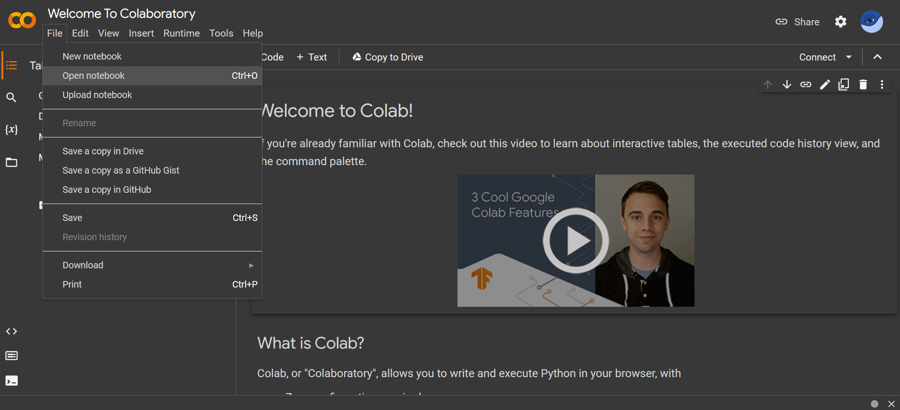
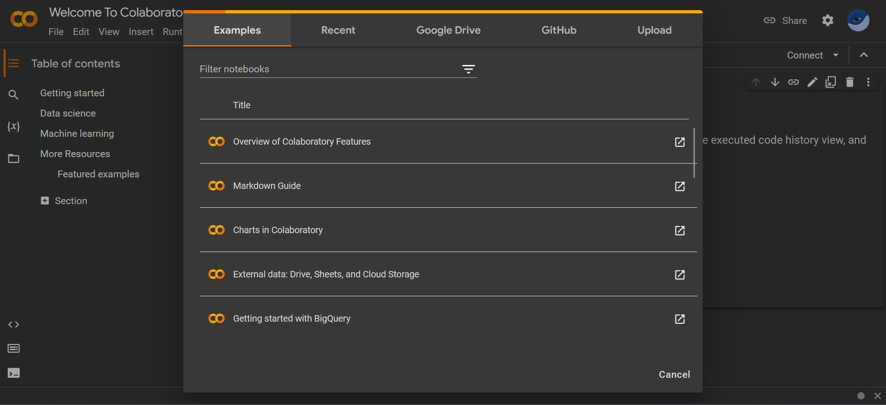
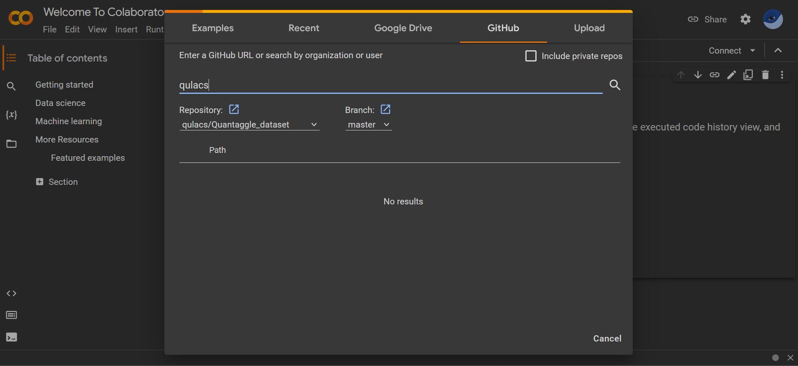
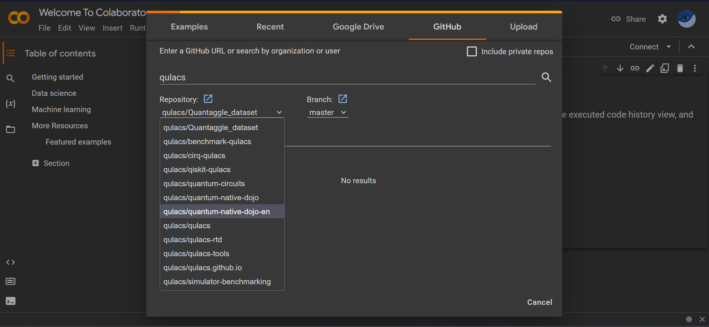
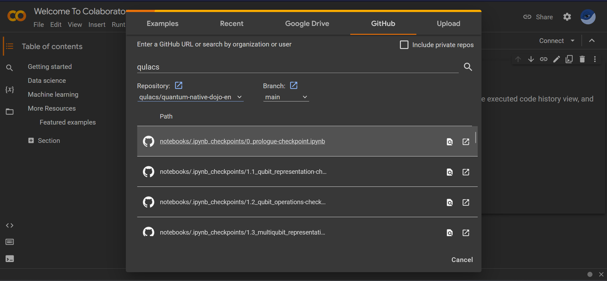

# Welcome to Quantum Native Dojo !

Quantum Native Dojo is a self-study material designed for those who want to learn about quantum computers.

You can learn the basic principles of quantum computers, basic algorithms, and how to apply them to chemical and financial calculations. The material covers algorithms for quantum computers with error correction, as well as algorithms for NISQ (Noisy Intermidiate-Scale Quantum) devices, which will be in practical use within a few years.

All the materials are built on Jupyter notebooks and can be run directly on Google Colaboratory, so you can start learning without any complicated setup.

There is also a website version, so please use it as well.
https://dojo.qulacs.org

## Objective of this material：Becoming Quantum Native

Quantum computers perform calculations based on the principles of quantum mechanics. However, the physical phenomena we see in everyday life are mainly governed by classical mechanics. This is one of the reasons why people think that quantum computers are difficult.

The goal of Quantum Native Dojo is to help you become a **Quantum Native** who understands the operation of quantum computers and can use them in practice. The road to becoming a Quantum Native is not an easy one, but learning the principles and applications of quantum mechanics and quantum computing from the basics through this Dojo will be a steady step forward.

We hope that you will leave this Dojo and become Quantum Natives and become engineers who create various quantum algorithms/applications!

## Prerequisite Knowledge
To understand the content of Quantum Native Dojo, you need to know the following:

- What is a complex number?;
- Differential and integral calculus of simple functions (sin, cos, exp, ...);
- What is matrix and vector multiplication and diagonalization.

If you are not comfortable with this prerequisite knowledge and with Python and NumPy, we recommend that you first learn those mathematical concept and how to use them in Python.

## How to proceed with the material
Basically, you will read/run `Jupyter notebooks` in the "notebook" folder of this repository.
Each `Jupyter notebook` can be run on `Google Colabolatory`, so you don't need to build your own environment.
(Of course, if you are familiar with Python, you can run the notebooks at hand and use them until you are satisfied.)

### When you run on `Google Colabolatory` 
1. Open [Google Colabolatory](https://colab.research.google.com/notebooks/welcome.ipynb?hl=en) 
2. choose `File` > `Open notebook` 

3. Select `GITHUB` tab ,and enter `qulacs`

4. Choose `qulacs/quantum-native-dojo-en` at repository pull down, and select  `main` branch

5. Choose the notebook you want to open

### When you run on `Jupyter notebook`
1. Fork [Quantum Native Dojo repository](https://github.com/qulacs/quantum-native-dojo-en) 
2. On console, type `$ jupyter notebook` and [run notebook](https://jupyter.readthedocs.io/en/latest/running.html#running)

To run `Jupyter`, you need to install `Python 3.3` or higher and `Jupyter`.

You will also need to install `numpy`, `scipy`, and `sympy` to run the code embedded in the notebook.
The `anaconda3` installation is a convenient way to install all of the above packages together.

## index
===== Part1：Basic =====
- Chapter 0: What is quantum computer？
- Chapter 1: Quantum information foundation
  - 1-1. Quantum bit
  - 1-2. Basic operations on qubits
  - 1-3. Multiqubit representation
  - Column：What is a universal gate set?
  - 1-4. Quantum circuit diagram
  - Column1：The No-Cloning theorem
  - Column2：Bell (CHSH) inequality
- Chapter 2: Introduction to Quantum Algorithms
  - 2-1. NISQ algorithms and long-term algorithms
  - 2-2. Hadamard test
  - Column：Quantum Random Number Generator
  - 2-3. Quantum Fourier transform
  - 2-4. Phase Estimation Algorithm（Introductory）
- Chapter 3: Execution environment of algorithm
  - 3-1. How to use Qulacs the fastest simulator
  - 3-2. How to use Qiskit and IBM Q Experience

===== Part2：NISQ =====
- Chapter 4: Quantum dynamics simulation
  - 4-1. Quantum dynamics simulation
  - 4-2. Quantum dynamics simulation using Trotter decomposition
- Chapter 5: Variational Quantum Circuit based algorithm
  - 5-1. Variational Quantum Eigensolver（VQE) algorithm
  - 5-2. Quantum Circuit Learning (QCL)
  - Column：application of QCL to classification 
  - Column：Quantum reservoir computing
  - 5-3. Quantum Approximate Optimization Algorithm (QAOA)
- Chapter 6: Quantum Chemistry Calculation
  - 6-1. OpenFermion basics
  - 6-2. Qulacs implementation of variational quantum eigensolver (VQE)
  - 6-3. Excited state search method (subspace-search VQE)

===== Part3：Long-term =====
- Chapter 7: Quantum phase estimation algorithm
  - 7-1. Detailed explanation of Quantum phase estimation algorithm：Hydrogen molecule as an example
  - 7-2. Harrow-Hassidim-Lloyd (HHL) algorithm
  - Column：Quantum Random Access Memory(qRAM)
  - 7-3. Portfolio optimization using HHL algorithm
  - Column：Fast singular values decomposition for low rank matrix and sampling（Quantum-inspired algorithm)
- Chapter 8: Quantum search algorithm
  - 8-1. Oracle
  - 8-2. Grovers algorithm
- Chapter 9: Quantum error correction
  - 9-1. Classic error correction
  - 9-2. Quantum error correction
 
Chapters with `*` needs prerequisite knowledge in physics and chemistry

## Recommended Books
It is best to read the Niesen-Chaung textbook, which is the gold standard for quantum computers (it is very large, so it will take some time).

- M. Nielsen and I. Chuang,  "[Quantum Computation and Quantum Information: 10th Anniversary Edition](https://www.cambridge.org/highereducation/books/quantum-computation-and-quantum-information/01E10196D0A682A6AEFFEA52D53BE9AE#overview)", Cambridge University Press (2010)

## Community
Please ask  questions here:
[Qulacs Slack Community](https://join.slack.com/t/qulacs/shared_invite/enQtNzY1OTM5MDYxMjAxLWM1ZDc3MzdiNjZhZjdmYTQ5MTJiOTEzZjI3ZjAwZTg0OGFiNjcxY2VjZWRjMWY0YjE5ZTViOWQzZTliYzdmYzY)

## Authors
This material is created and updated by  [QunaSys](https://qunasys.com) and the following Contributor.

[Keisuke Fujii](http://quantphys.org/wp/keisukefujii/),
[kwkbr](https://github.com/kwkbtr),
[MakotoNakai](https://github.com/MakotoNakai),
[yoooopeeee](https://github.com/yoooopeeee),
[Kosuke Mitarai](https://scholar.google.com/citations?user=TfsGcnMAAAAJ),
[Yuya-O-Nakagawa](https://scholar.google.co.jp/citations?user=LyU8LXsAAAAJ),
[yamamoto-takahiro](https://github.com/yamamoto-takahiro),
[Akira Yamazaki](https://github.com/ayamazaki),
[Karim Essafi](https://github.com/essafik),
[Adam Wesolowski](https://github.com/notalp1)

## release history
- 2023/6/30: v2.0.0
- 2019/4/26: v0.1.0
- 2019/12/5: v1.0.0 
